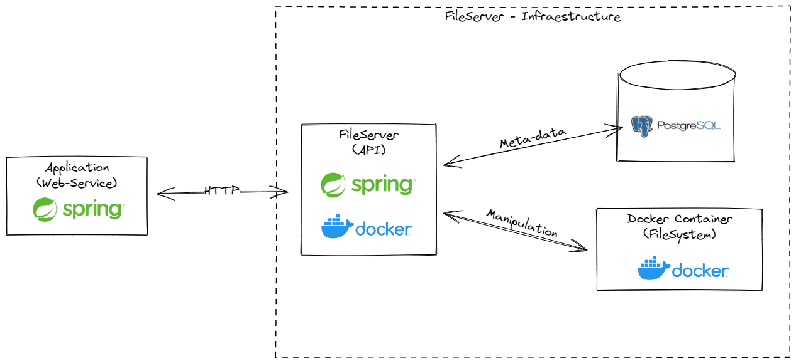
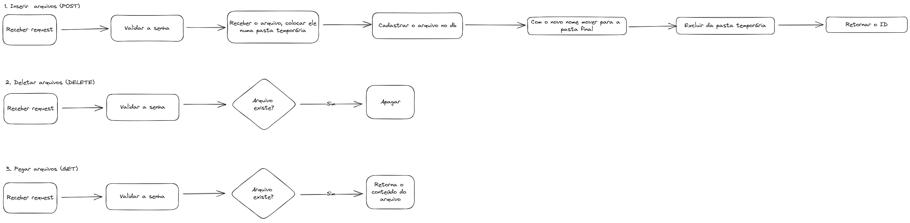

# tcc-file-server
Projeto de servidor de arquivos para o TCC

## Problema

No meu projeto de TCC eu vou trabalhar com arquivos. Porém como não é uma boa ideia deixar os arquivos salvos no contexto da minha aplicação, para isso eu preciso de um servidor de arquivos que permita a aplicação cadastrar, remover e baixar arquivos para trabalhar com eles.

## Topologia

## Explicação

A infraestrutura da aplicação é composta por 2 containers.

1. Aplicação Spring Boot
2. Servidor de banco de dados.

A aplicação Spring Boot permitirá que outra aplicações se comuniquem com o servidor, permitindo a manipulação dos arquivos que serão salvos no sistema de arquivos do container. Salvando os arquivos e algumas informações sobre eles no banco de dados.

## Esquema de banco de dados
>
>
>

## Fluxo do MVP

